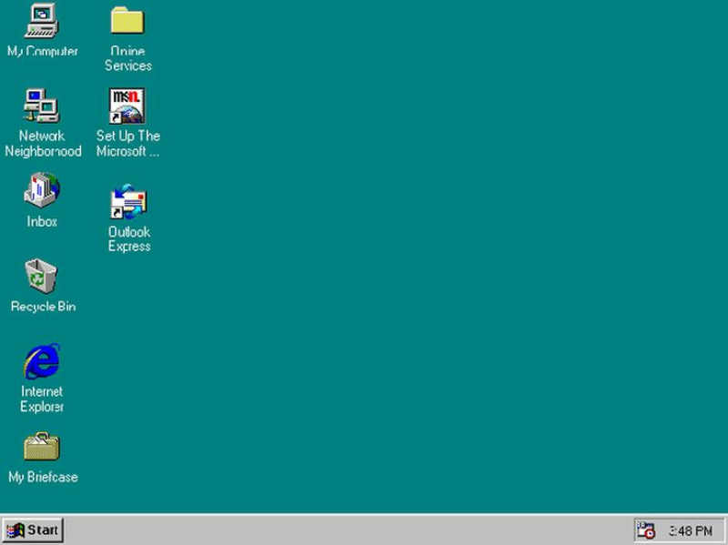
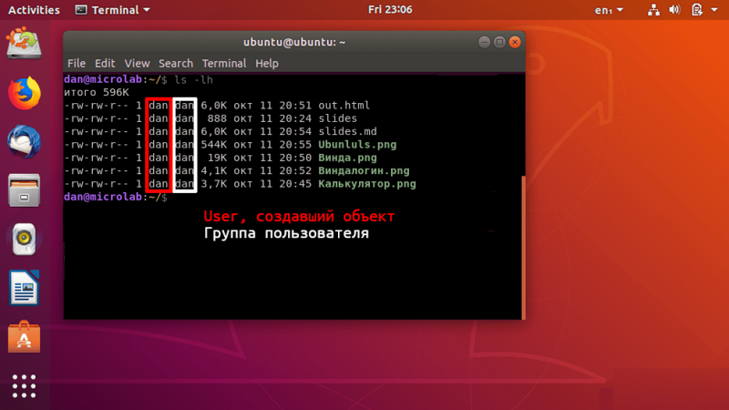
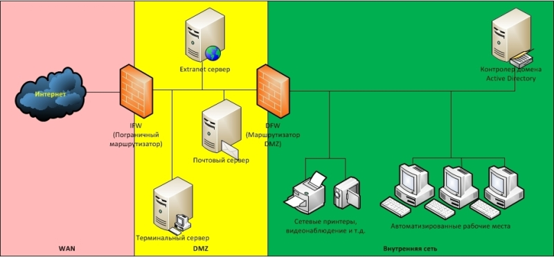
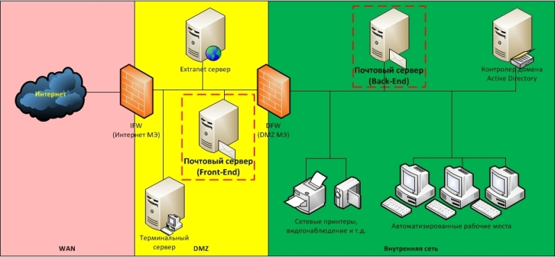

# Модуль 1. Периметры безопасности и размещение сервисов в сети предприятия

## Обзор моделей безопасности и обязанностей администратора безопасности компьютерной сети

[Должностная инструкция aдминистраторa информационной безопасности](https://clck.ru/RLQU6)

[Должностная инструкция администратора безопасности компьютерных систем и сетей](https://clck.ru/RLQVR)

[Руководящий документАвтоматизированные системы. Защита от несанкционированного доступа к информации Классификация автоматизированных систем и требования по защите информации](https://clck.ru/DXeeB)

**Важный факт!**
*Вопросы информационной безопасности можно рассматривать только 
при наличии четко определенных конфликтующих сторон.*

Сокращения:
> АС - автоматизированные системы
> НСД - несанкционированный доступ
> СЗИ - система защиты информации
> СЗИ НСД - система защиты информации от несанкционированного доступа

1. Классификация распространяется на все действующие и проектируемые АС учреждений, организаций и предприятий, обрабатывающие конфиденциальную информацию.
2. Деление АС на соответствующие классы по условиям их функционирования с точки зрения защиты информации необходимо в целях разработки и применения обоснованных мер по достижению требуемого уровня защиты информации.
3. Дифференциация подхода к выбору методов и средств защиты определяется важностью обрабатываемой информации, различием АС по своему составу, структуре, способам обработки информации, количественному и качественному составу пользователей и обслуживающего персонала.
4. Необходимыми исходными данными для проведения классификации конкретной АС являются:

	* перечень защищаемых информационных ресурсов АС и их уровень конфиденциальности;
	* перечень лиц, имеющих доступ к штатным средствам АС, с указанием их уровня полномочий;
	* матрица доступа или полномочий субъектов доступа по отношению к защищаемым информационным ресурсам АС;
	* режим обработки данных в АС.

1. К числу определяющих признаков, по которым производится группировка АC в различные классы, относятся:

	* наличие в АС информации различного уровня конфиденциальности;
	* уровень полномочий субъектов доступа АС на доступ к конфиденциальной информации;
	* режим обработки данных в АС - коллективный или индивидуальный.

1. Устанавливается три группы и девять классов защищенности АС от НСД к информации.

	- Третья группа включает АС, в которых работает один пользователь. Группа содержит два класса - 3Б и 3А.
	- Вторая группа включает АС, в которых работает много пользователей с одинаковыми правами. Группа содержит два класса - 2Б и 2А.
	- Первая группа включает многопользовательские АС. Группа содержит пять классов - 1Д, 1Г, 1В, 1Б и 1А.

*Примеры*

### Калькулятор Windows.

С т.з. данной программы все пользователи - один. Т.е. категория - 3.

### Windows 9x

В системе присутствует "Окно входа в систему"...

... т.е. пользователи различаются. Но из-за ограничений файловой системы FAT(VFAT) 
их права не разграничены. Т.е. категория 2.

### Ubuntu Linux

Как мы знаем, в большинстве современных ОС имеется разделение прав доступа к объектам. Т.е. Ubuntu (например) - категория 1.

### Вопросы:
1) Правомочно ли рассматривать Калькулятор Windows как АС?

2) Приведите примеры АС II категории?

3) Определите категорию АС: сайт статической верстки, обновление выполняется по FTP.

Идентификация, проверка подлинности и контроль доступа субъектов

Регистрация и учет: входа (выхода) субъектов доступа в (из) систему(ы) (узел сети)

Регистрация и учет: выдачи печатных (графических) выходных документов

Регистрация и учет: запуска (завершения) программ и процессов (заданий, задач)

Регистрация и учет: доступа  программ  субъектов  доступа  к  файлам, 

Регистрация и учет: доступа к терминалам, ЭВМ, узлам сети ЭВМ, каналам связи, внешним устройствам ЭВМ, программам, томам, каталогам, файлам, записям, полям записей.

Регистрация и учет: изменения полномочий субъектов доступа.

 - дата и время входа (выхода) субъекта доступа в систему (из системы) или загрузки (останова) системы.
 - результат   попытки   входа:   успешная   или   неуспешная 
 - несанкционированная;
 - идентификатор (код или фамилия) субъекта, предъявленный при попытке доступа;
 - должен  проводиться  учет  всех  защищаемых  носителей  информации  с помощью их маркировки и с занесением учетных данных журнала (учетную карточку);
 - учет защищаемых носителей должен проводиться в журнале с регистрацией их выдачи.

Обеспечение целостности программных средств и обрабатываемой информации

 - целостность СЗИ НСД проверяется при загрузке системы по контрольным суммам компонент СЗИ;
 - целостность  программной  среды  обеспечивается  использованием трансляторов с языков высокого уровня и отсутствием средств модификации объектного  кода  программ  в  процессе  обработки  и  хранения защищаемой информации;
 - должно проводиться периодическое тестирование функций СЗИ НСД при изменении программной среды и персонала АС с помощью тест-программ, имитирующих попытки НСД;
 - должны  быть  в  наличии  средства  восстановления  СЗИ  НСД, предусматривающие ведение двух копий программных средств СЗИ НСД и их периодическое обновление и контроль работоспособности.

Наличие администратора (службы) защиты информации в АС

Периодическое тестирование СЗИ НСД

Наличие средств восстановления СЗИ НСД

### Задачи и функции Администратора информационной безопасности

- Kонтроль эффективности защиты информации;
- Cопровождение СЗИ от  НСД и основных технических средств и систем;
- Kонтроль разграничения доступа.
- Kонтроль соответствия действий пользователей АС требованиям.
- Участие на стадии проектирования (внедрения) АС в разработке технологии обработки информации ограниченного доступа (далее – информации) по вопросам:
	- организации порядка учета, хранения и обращения с документами и носителями информации;
  - определения степени секретности отдельных документов, носителей и массивов информации;
  - подготовки инструкций, определяющих задачи, функции, ответственность, права и обязанности  администраторов и пользователей АС по вопросам защиты информации, а также ответственных по защите информации в процессе автоматизированной обработки информации.
- Сопровождение СЗИ от НСД к ней, в том числе средств криптографической защиты информации.
- Контроль соответствия общесистемной программной среды стандарту (контроль целостности программного обеспечения) и проверка включаемых в АС новых программных средств.
- Методическое руководство работой администраторов и пользователей АС в вопросах обеспечения информационной безопасности.
- Ведение переченя установленных в подразделениях ОТСС, СЗИ от НСД и перечень задач, решаемых с их использованием.
- Непосредственное управление режимами работы и административную поддержку функционирования \ применяемых на рабочих станциях специальных программных и программно-аппаратных СЗИ от НСД.
- Периодически проверять состояние используемых СЗИ от НСД, осуществлять проверку правильности их настройки (выборочное тестирование).
- Вести журнал учета нештатных ситуаций, фактов вскрытия и опечатывания, защищенных СВТ, выполнения профилактических работ, установки и модификации аппаратных и программных СЗИ.
- Проводить работу по выявлению возможности вмешательства в процесс функционирования АС и осуществления НСД к информации и техническим средствам РС.
- Докладывать руководству о выявленных угрозах безопасности информации, обрабатываемой в АС, об имевших место попытках НСД к информации и техническим средствам РС.

## Разделение сервисов сети предприятия 

### Вариант 1. Плоская сеть

В данном варианте все узлы корпоративной сети содержатся в одной, общей для всех сети («Внутренняя сеть»), в рамках которой коммуникации между ними не ограничиваются. Сеть подключена к Интернет через пограничный маршрутизатор/межсетевой экран.

Плюсы варианта:

 - Минимальные требования к функционалу IFW (можно сделать практически на любом, даже домашнем роутере).
	
 - Минимальные требования к знаниям специалиста, осуществляющего реализацию варианта.

Минусы варианта:

  - Минимальный уровень безопасности. В случае взлома, при котором Нарушитель получит контроль над одним из опубликованных в Интернете серверов, ему для дальнейшей атаки становятся доступны все остальные узлы и каналы связи корпоративной сети.

### Вариант 2. DMZ

Для устранения этого недостатка узлы сети, доступные из Интернет, помещают в специально выделенный сегмент – демилитаризованную зону (DMZ). DMZ организуется с помощью межсетевых экранов, отделяющих ее от Интернет 
(IFW) и от внутренней сети (DFW).

При этом правила фильтрации межсетевых экранов выглядят следующим образом:

- Из внутренней сети можно инициировать соединения в DMZ и в WAN (Wide Area Network).
- Из DMZ можно инициировать соединения в WAN.
- Из WAN можно инициировать соединения в DMZ.
- Инициация соединений из WAN и DMZ ко внутренней сети запрещена.

Плюсы варианта:

 - Повышенная защищённость сети от взломов отдельных сервисов. Даже если один из серверов будет взломан, Нарушитель не сможет получить доступ к ресурсам, находящимся во внутренней сети (например, сетевым принтерам, системам видеонаблюдения и т.д.).

Минусы варианта:

- Сам по себе вынос серверов в DMZ не повышает их защищенность.
- Необходим дополнительный МЭ для отделения DMZ от внутренней сети.

### Вариант 3. Разделение сервисов на Front-End и Back-End

Одним из вариантов исправления ситуации является разделение функционала сервиса на две части: Front-End и Back-End. При этом каждая часть располагается на отдельном сервере, между которыми организуется сетевое взаимодействие. Сервера Front-End, реализующие функционал взаимодействия с клиентами, находящимися в Интернет, размещают в DMZ, а сервера Back-End, реализующие остальной функционал, оставляют во внутренней сети. Для взаимодействия между ними на DFW создают правила, разрешающие инициацию подключений от Front-End к Back-End.

Плюсы варианта:

  - В общем случае атаки, направленные против защищаемого сервиса, могут «споткнуться» об Front-End, что позволит нейтрализовать или существенно снизить возможный ущерб. Например, атаки типа TCP SYN Flood или slow http read, направленные на сервис, приведут к тому, что Front-End сервер может оказаться недоступен, в то время как Back-End будет продолжать нормально функционировать и обслуживать пользователей.
  - В общем случае на Back-End сервере может не быть доступа в Интернет, что в случае его взлома (например, локально запущенным вредоносным кодом ) затруднит удаленное управление им из Интернет.
  - Front-End хорошо подходит для размещения на нем межсетевого экрана уровня приложений (например, Web application firewall) или системы предотвращения вторжений (IPS, например snort).

Минусы варианта:

  - Для связи между Front-End и Back-End на DFW создается правило, разрешающее инициацию соединения из DMZ во внутреннюю сеть, что порождает угрозы, связанные с использованием данного правила со стороны других узлов в DMZ (например, за счет реализации атак IP spoofing, ARP poisoning и т. д.)
  - Не все сервисы могут быть разделены на Front-End и Back-End.
  - В компании должны быть реализованы бизнес-процессы актуализации правил межсетевого экранирования.
  - В компании должны быть реализованы механизмы защиты от атак со стороны Нарушителей, получивших доступ к серверу в DMZ.

# Лабораторные работы: Развертывание шлюза и сетей предприятия

## Настройка шлюза для подключения сети предприятия к Internet

[Обеспечение работоспособности и защиты межсетевого экрана с помощью iptables](https://clck.ru/RLqPk)

1) Изучить литературу по ссылке.

2) Используя виртуальную машину (или хост) сконфигурировать:

 - Файервол плоской сети
 - Проброс порта 80 на один из внутренних хостов

3) Продемонстрировать результат, используя nmap для тестирования.